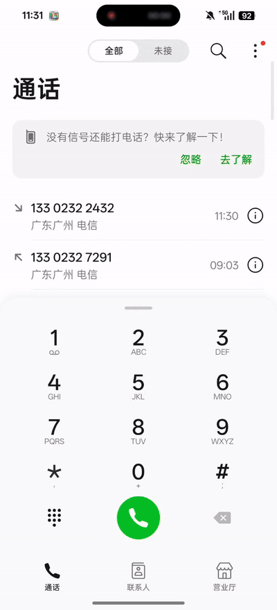

注：本文旨在帮助开发人员理解5G增强通话终端SDK的架构设计，便于开发人员快速基于本项目进行二次开发或直接编译使用，以及指导5G增强通话小程序的开发调试。
# 5G增强通话终端SDK
- 5G增强通话是在IMS音频、视频通道的基础上增加数据通道（即IMS Data Channel）并融入AR、AI等技术，实现在通话时进行交互式信息传递。 

- 5G增强通话终端SDK（下文称SDK）由中国电信研究院开发。通话建立后，芯片与网络会协商IMS Data Channel的建立，终端对IMS Data Channel的调用逻辑进行封装并通过AIDL接口（即Android接口定义语言[Android Interface Definition Language](https://developer.android.google.cn/develop/background-work/services/aidl?hl=zh-cn)）提供给SDK，SDK作为5G增强通话小程序（下文称小程序）的运行载体，将操作IMS Data Channel和终端其他能力接口通过统一的接口提供给小程序调用。

     

&nbsp;&emsp;&nbsp;屏幕共享（左：发起方 右：接收方）&emsp;&emsp;&emsp;&nbsp;&nbsp;翼分享（左：发起方 右：接收方）&emsp;&nbsp;&emsp;&emsp;10000号客服小程序

## 一、功能特性
SDK在遵循3GPP、GSMA等国际标准的同时，还实现了如下功能特性：
- 与通话状态紧关联，负责小程序的生命周期管理，为小程序提供稳定的运行环境；  
- 小程序存储空间隔离，保证数据安全；  
- 为小程序提供操作IMS Data Channel和终端其他能力的接口；
- 支持多个小程序同时运行，每个小程序拥有独立进程；  
- 支持通话后打开使用小程序；  
- 支持不同运营商、终端厂商实现拓展能力接口，以AAR包形式引入各自私有的特色能力；  
- 在通话中关闭小程序时支持IMS Data Channel缓存，避免重新打开小程序时重新创建IMS Data Channel；  
- 支持对权限、数据隐私等敏感的JS API通过license验证机制进行管控；
- 支持模拟通话、加载本地小程序包进行离线调试。

## 二、架构设计
   
- 继承InCallService：SDK通过继承InCallService（ https://developer.android.google.cn/reference/android/telecom/InCallService ）获取通话信息，与通话状态紧关联，在通话建立的时候开始运行，在通话结束的时候释放资源，查阅SDK代码：[core/src/main/java/com/ct/ertclib/dc/core/service/InCallServiceImpl.kt](core/src/main/java/com/ct/ertclib/dc/core/service/InCallServiceImpl.kt)。  
- TS.71 IDL接口：SDK与终端之间的接口，SDK通过这些接口获取小程序列表、下载小程序包，根据小程序指示创建IMS Data Channel、接受和发送数据，查阅SDK代码：[core/src/main/aidl/com/newcalllib/datachannel/V1_0](core/src/main/aidl/com/newcalllib/datachannel/V1_0)。  
- 拓展能力接口：为推进5G增强通话终端SDK的统一，即终端上只运行一个SDK，同时满足运营商为各自平台小程序提供特色能力的需求，SDK设计了拓展能力接口，允许不同运营商、终端厂商以AAR包形式引入的各自私有的特色能力，供小程序调用。  
  1）拓展能力接口定义，查阅SDK代码：[base/src/main/java/com/ct/ertclib/dc/base/port/ec/IEC.kt](base/src/main/java/com/ct/ertclib/dc/base/port/ec/IEC.kt)；  
  2）SDK接入和管理拓展能力的逻辑，查阅SDK代码：[core/src/main/java/com/ct/ertclib/dc/core/manager/common/ExpandingCapacityManager.kt](core/src/main/java/com/ct/ertclib/dc/core/manager/common/ExpandingCapacityManager.kt)；  
  3）终端厂商实现拓展能力的示例，查阅SDK代码：[oemec/src/main/java/com/ct/oemec/OemEC.kt](oemec/src/main/java/com/ct/oemec/OemEC.kt)。  
- JS API接口：小程序与SDK之间的接口，使用DSBridge（ https://github.com/wendux/DSBridge-Android ）框架实现，小程序通过这些接口操作IMS Data Channel和终端其他能力（包括上述拓展能力），查阅SDK代码：[core/src/main/java/com/ct/ertclib/dc/core/miniapp/bridge/JSApi.kt](core/src/main/java/com/ct/ertclib/dc/core/miniapp/bridge/JSApi.kt)。

## 三、项目结构 
NewCall  
├── app/小程序列表展示相关  
├── base/基础公共类，其他模块不直接引用，编译成aar后引用  
│   ├── data/数据结构  
│   └── port/接口  
├── build-logic/存放项目构建相关文件    
├── core/核心逻辑代码  
│   ├── aidl/DC、屏幕共享、拓展能力等AIDL接口  
│   └── core/  
│       ├── common/通用工具  
│       ├── constants/常量配置  
│       ├── data/数据结构  
│       ├── dispatcher/js api、小程序服务事件调度  
│       ├── factory/调度器工厂
│       ├── manager/各种管理类  
│       ├── miniapp/小程序(管理、UI、DC等)相关  
│       ├── picker/图片选择  
│       ├── port/各种接口  
│       ├── service/小程序、通话等服务  
│       ├── ui/除小程序空间和小程序本身的其他UI  
│       ├── usecase/js api、小程序服务事件处理  
│       └── utils/工具类   
├── libs/第三方库文件  
├── miniapp/小程序开发相关  
│   ├── webrtcDC/基于SDK实现GSMA TS.66定义的接口，可编译出webrtcDC.js库供小程序集成使用  
│   └── demo/小程序示例  
├── oemec/终端厂商拓展能力  
├── script/编译脚本  
└── testing/本地模拟测试相关  

## 四、技术栈
- 编程语言：Kotlin、java、js  
- 架构模式：MVVM  
- 异步处理：Coroutines + Flow  
- 数据库：Room  
- UI 框架：Jetpack Compose / XML Layouts  

## 五、开发环境
- JDK 版本 17
- Gradle 版本 8.1
- Android SDK 版本 compileSdk-34，minSdk-26
- 推荐开发工具 AndroidStudio

## 六、快速开始（构建发布）
- 打包：目前共配置了三个渠道包：Normal(悬浮球入口版本)、Dialer(拨号盘入口版本)、Local(本地调试版本，仅用于本地调试)
   ```bash
   ./gradlew assembleRelease 

- 终端适配：  
终端需遵循[《中国电信5G增强通话商用SDK终端适配规范》](./document/中国电信5G增强通话商用SDK终端适配规范.docx)进行适配，以使SDK各功能正常运行。  

- 发布：  
终端厂商将SDK作为系统默认应用集成，随系统一起推送至经过适配的用户终端。
当用户通话时，如果终端集成Normal版本，原生通话界面上会以悬浮球的形式出现5G增强通话图标，点击该图标即可打开5G增强通话小程序空间；如果终端集成Dialer版本，且按照适配规范实现，原生通话界面会出现固定入口按钮，点击该按钮即可打开5G增强通话小程序空间。

## 七、小程序开发调试
使用Local(本地调试版本)SDK，无需依赖IMS Data Channel的网络环境，无需终端适配，即可在普通Android终端上调试小程序。
- 小程序开发：开发者需遵循HTML5、CSS3、ES6等web标准进行web网页开发，[《中国电信5G增强实时通信系统技术要求 IMS Data Channel JS API》](./document/中国电信5G增强实时通信系统技术要求%20IMS%20Data%20Channel%20JS%20API.docx)列举了SDK开放给小程序的所有接口，小程序开发者根据这份文档进行小程序的开发，小程序参考示例代码：[miniapp/demo/IMS_DC_Mini_app_demo_source_code](miniapp/demo/IMS_DC_Mini_app_demo_source_code)。  
- 小程序打包：将web项目打包为离线的zip格式压缩包，即小程序包，index.html和properties.json文件需在zip压缩包的一级目录中,参考示例小程序包：[miniapp/demo/IMS_DC_Mini_app_demo.zip](miniapp/demo/IMS_DC_Mini_app_demo.zip)。  
- 小程序本地调试：按照普通apk安装方式将Local版本SDK安装到手机，并将小程序zip包推至手机sdcard中，然后从手机桌面启动“电信增强通话”app，按照指引授权后，打开设置-本地调试入口，即可配置并调试小程序。  
    

## 八、许可证
本项目采用 [Apache2.0](https://www.apache.org/licenses/LICENSE-2.0.txt) 开源协议。

## 九、联系方式
xuq17@chinatelecom.cn

pengc23@chinatelecom.cn
